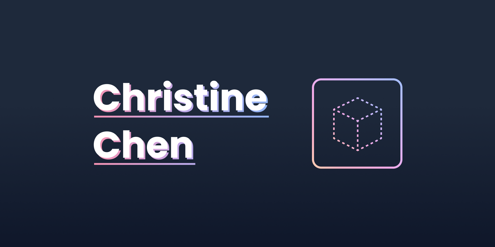

# cublibre-v2

[](https://cublibre.github.io/personal-v2/)

The "second" iteration of my personal website.



## Background

I abandoned the first version of my website right after I published it because I didn't like how it turned out... (。\_。)
So I went back to Figma and made two redesigns before I came up with one that looks (hopefully) better!

## Features / Todo

- [ ] Hero
- [ ] About section
- [ ] Experience
- [ ] Projects
- [ ] Blog

## Lessons Learned

### Design

- While redesigning I found that I tended to make a rounded rectangle with large border
  radius and drop shadows the main (and only) container at all times, so I tried my best
  to avoid doing that.
- Because of that I had some trouble coming up with new ideas, so I looked at dribbble,
  Behance, and other people's portfolios for inspiration. From them I learned to play
  around with typography, colors, and spacing- a small change in these areas can make a
  big impact on readability and aesthetics.

### Development

- I switched to Typescript for this project in an attempt to learn it.
- I also added Github Actions to learn how it works- it was pretty easy but now I have a
  cool badge like everyone else
- TBD

## Installation

1. Install npm

```bash
npm install
```

2. Run on local dev server (requires Gatsby CLI)

```
gatsby develop
```
