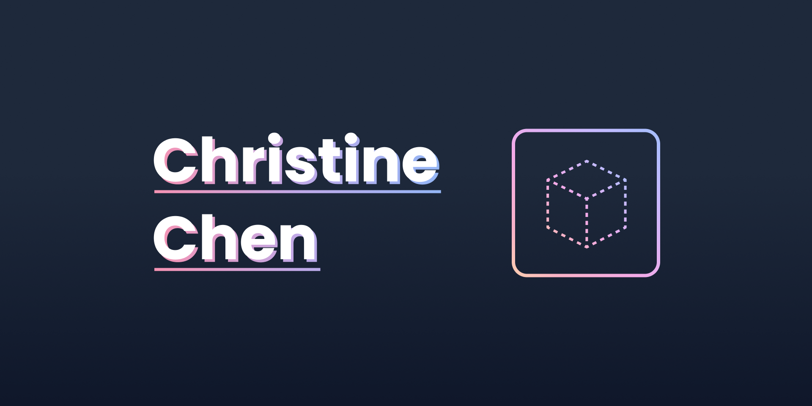

# cublibre-v2

[](https://cublibre.github.io/personal-v2/)

The second iteration of my personal website.



## Background

I abandoned the first version of my website right after I published it because I didn't like how it turned out... (。\_。)
So I went back to Figma and made two redesigns before I came up with one that looks (hopefully) better!

## Todo

- [x] Hero
- [x] About section
- [x] Experience
- [x] Projects
- [ ] Navbar
- [ ] Blog section (maybe)
- [ ] Animations

## Installation

1. Install npm package

```bash
npm install
```

2. Run on local dev server (requires Gatsby CLI)

```
gatsby develop
```

## Acknowledgements

- Special thanks to [Brittany Chiang](https://github.com/bchiang7/) for her amazing [portfolio](https://brittanychiang.com/).
